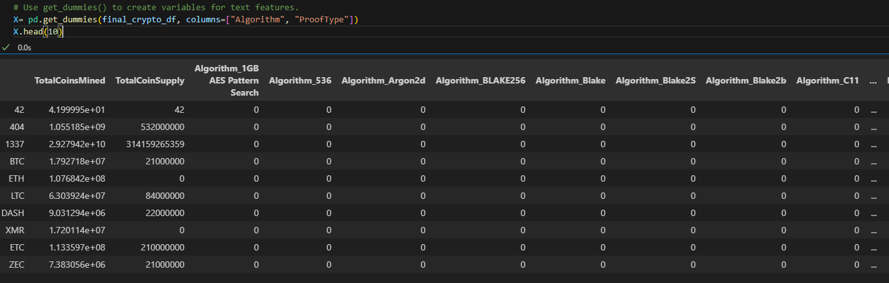
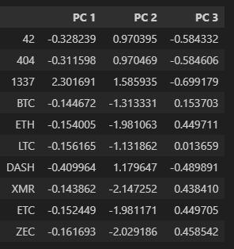
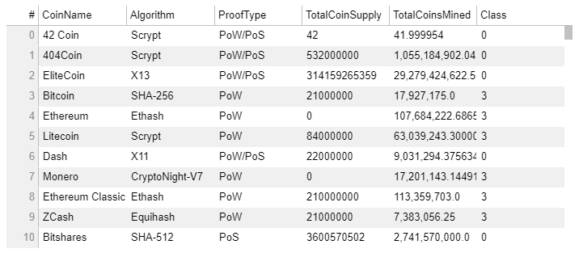
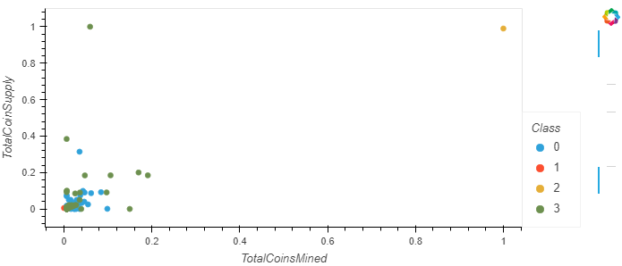

# Cryptocurrency Analysis

## Overview

The objective of this analysis was to use unsupervised machine learning to give our clients some legible information in the cryptocurrency market. There is a prominent bank that is interested in offering a new cryptocurrency investment for its customers. The cryptocurrency trading market is a giant, booming market right now and makes it difficult to wade through the sea of new and old cryptocurrency options.

## Results

The data that was received needed a lot of work before it could be used in a machine learning model. A CSV file was received that had over 1000 different lines of data.

### Preprocessing
First, all of the data would need to be preprocessed. The data will need to be in a binary format for an unsupervised machine learning model would function. Reading in the data into a Pandas DataFrame was the first step. From there, we kept only the cryptocurrencies actively being traded. Then I removed any unusable columns and cleared any rows that contained null values as this will affect our machine learning model. After preprocessing is complete the final DataFrame looked like this (note all of the binary columns): 

### Reducing data with PCA
The next step is reducing the data dimensions. To complete this step, I used a process called Principal Component Analysis (PCA). Using the information from the DataFrame, I reduced the dimensions to three principal compenents.

### Clustering
The third step consisted of clustering the data using a K-means algorithm. An elbow curve will be created using hvPlot to find the value for K. Once that is determine we can run the algorithm to predict the clusters. 

## Summary

Once all the data transforming is complete, all of the data can be provided in a nice easy to read table. additinally, now I can graph the data and visually see the plotted data. 

